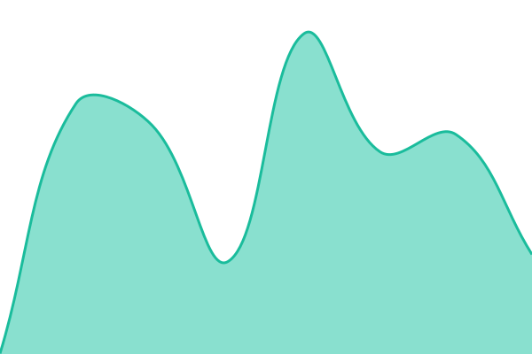

# [📈 Live Status](https://demo.upptime.js.org): <!--live status--> **🟧 Partial outage**

This repository contains the open-source uptime monitor and status page for [Upptime](https://upptime.js.org), powered by [Upptime](https://github.com/upptime/upptime).

With [Upptime](https://upptime.js.org), you can get your own unlimited and free uptime monitor and status page, powered entirely by a GitHub repository. We use [Issues](https://github.com/upptime/upptime/issues) as incident reports, [Actions](https://github.com/upptime/upptime/actions) as uptime monitors, and [Pages](https://demo.upptime.js.org) for the status page.

<!--start: status pages-->
<!-- This summary is generated by Upptime (https://github.com/upptime/upptime) -->
<!-- Do not edit this manually, your changes will be overwritten -->
<!-- prettier-ignore -->
| URL | Status | History | Response Time | Uptime |
| --- | ------ | ------- | ------------- | ------ |
|  [Pannello](https://panel.fluxservice.it) | 🟩 Up | [pannello.yml](https://github.com/volpiluca/status/commits/HEAD/history/pannello.yml) | 

 4988ms
     
 | 

<a href="https://status.fluxservice.it/history/pannello">93.90%</a>
    

|  [Billing](https://billing.fluxservice.it) | 🟥 Down | [billing.yml](https://github.com/volpiluca/status/commits/HEAD/history/billing.yml) | 

 5148ms
     
 | 

<a href="https://status.fluxservice.it/history/billing">93.57%</a>
    

|  [Sito](https://fluxservice.it) | 🟥 Down | [sito.yml](https://github.com/volpiluca/status/commits/HEAD/history/sito.yml) | 

 180ms
     
 | 

<a href="https://status.fluxservice.it/history/sito">100.00%</a>
    

|  [Node 01](https://node.fluxservice.it/api/system) | 🟥 Down | [node-01.yml](https://github.com/volpiluca/status/commits/HEAD/history/node-01.yml) | 

 777ms
     
 | 

<a href="https://status.fluxservice.it/history/node-01">100.00%</a>
    

<!--end: status pages-->

[**Visit our status website →**](https://demo.upptime.js.org)

## 📄 License

- Powered by: [Upptime](https://github.com/upptime/upptime)
- Code: [MIT](./LICENSE) © [Anand Chowdhary](https://anandchowdhary.com)
- Data in the `./history` directory: [Open Database License](https://opendatacommons.org/licenses/odbl/1-0/)
